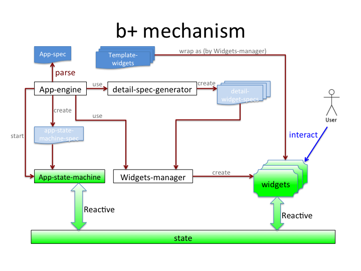

# b+ 数据应用框架

## 特点  
1. 最简应用生成（spec、excel表单、word表格）  
2. 实时数据更新  
3. 动态流程   
4. 动态权限    
5. 数据安全  
6. 云应用   
7. 分享（数据模型、权限机制、流程、应用、数据）   

## 模块  
1. a+ meteor adapter     
1.1 simple requirejs    
1.2 model manager   
1.3 meteor-mongo-collection-state 
1.4 package.js    
2. app-engine
3. spec-parsers (models, descriptions, behaviors)
4. widgets-detail-spec-generator
5. Widgets   
5.1 widgets-manager  
5.2 xxx-widget      
5.2.1 xxx-Widget    
5.2.2xxx-dom-creators	
5.2.3 xxx-dom-manager  
5.2.4 xxx-data-manager
6. Controls     
6.1 xxx-Control
7. Permission
8. Workflow